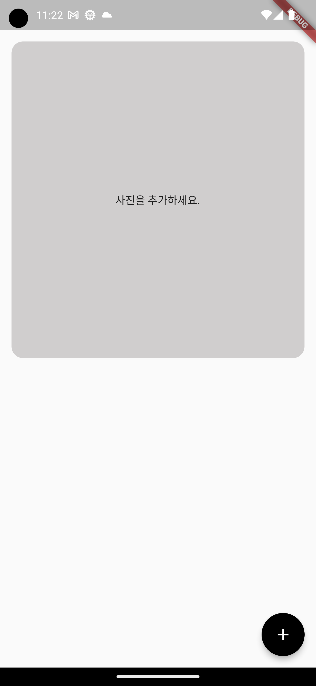
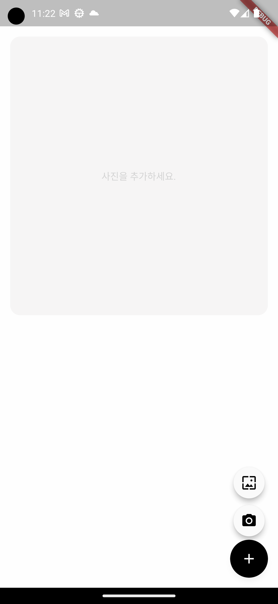
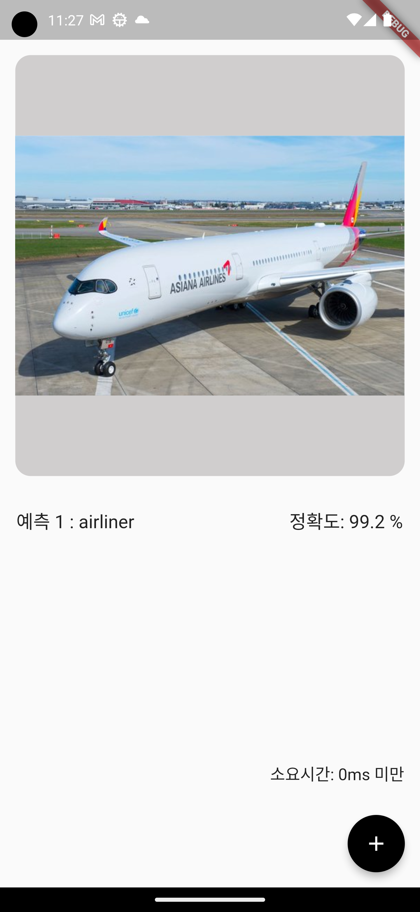
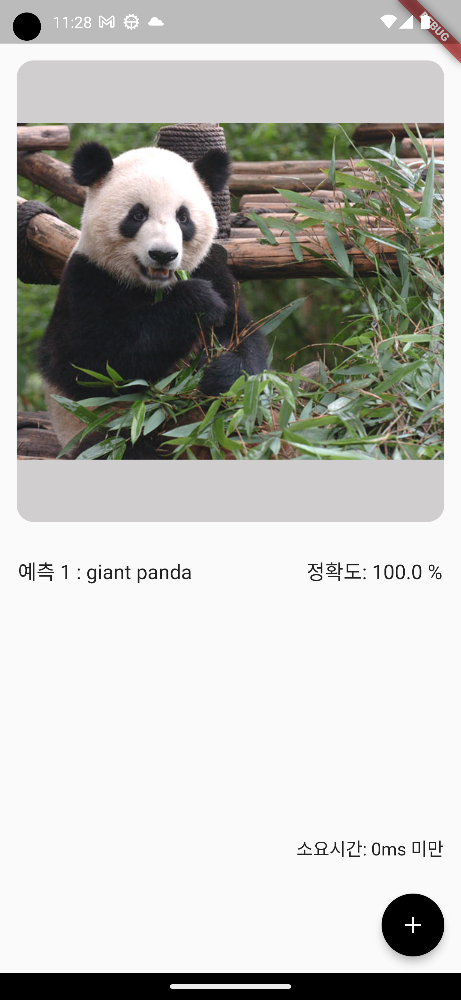
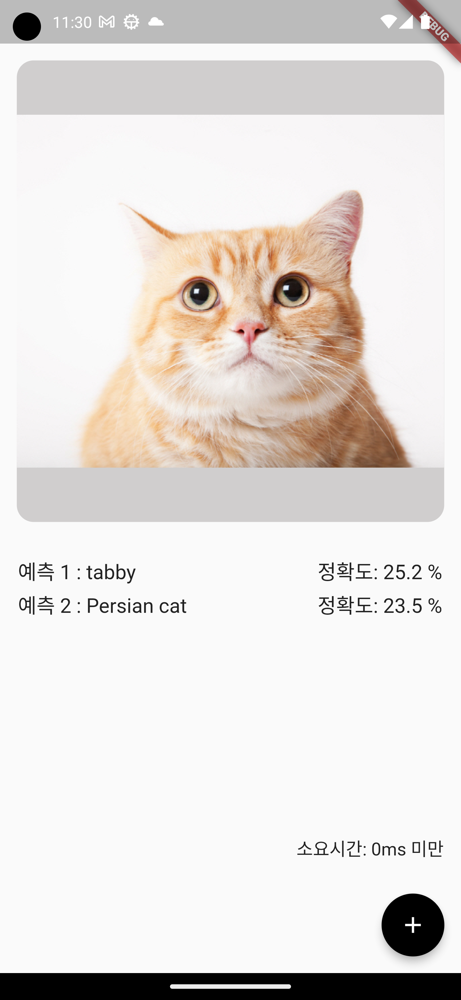

# image_classification_app

Make Image classification model

# Environment
Android Studio Electric Eel | 2022.1.1 Patch 1  
Flutter 3.10.2  
Dart 3.0.2  
Training Data from https://storage.googleapis.com/download.tensorflow.org/models/tflite/mobilenet_v1_1.0_224_float_2017_11_08.zip  
Test Image from Google

# Preview

